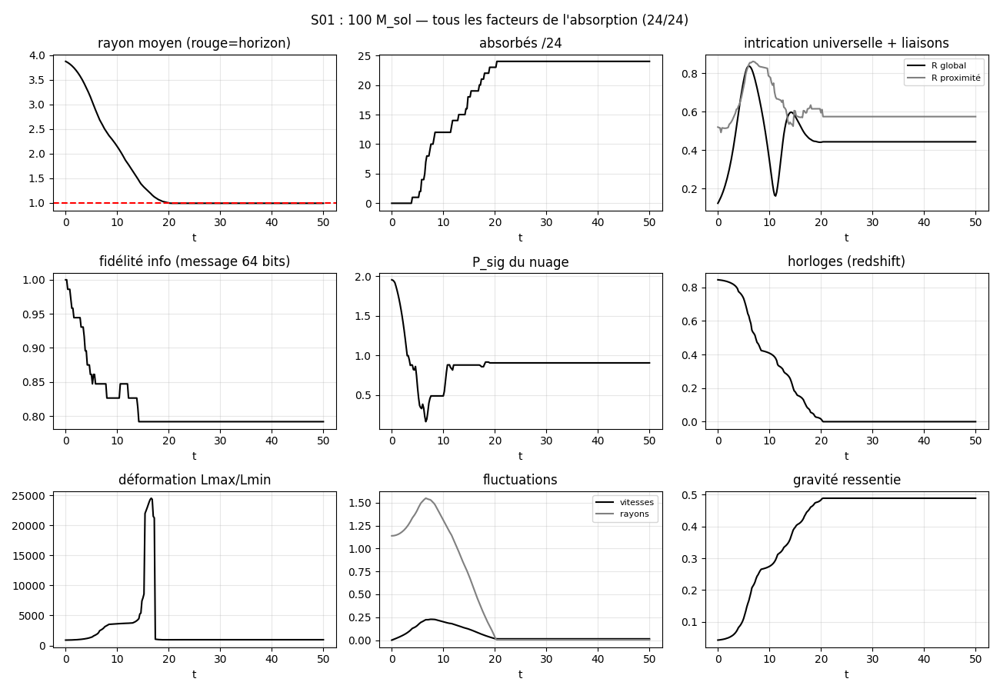
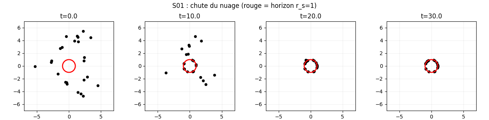
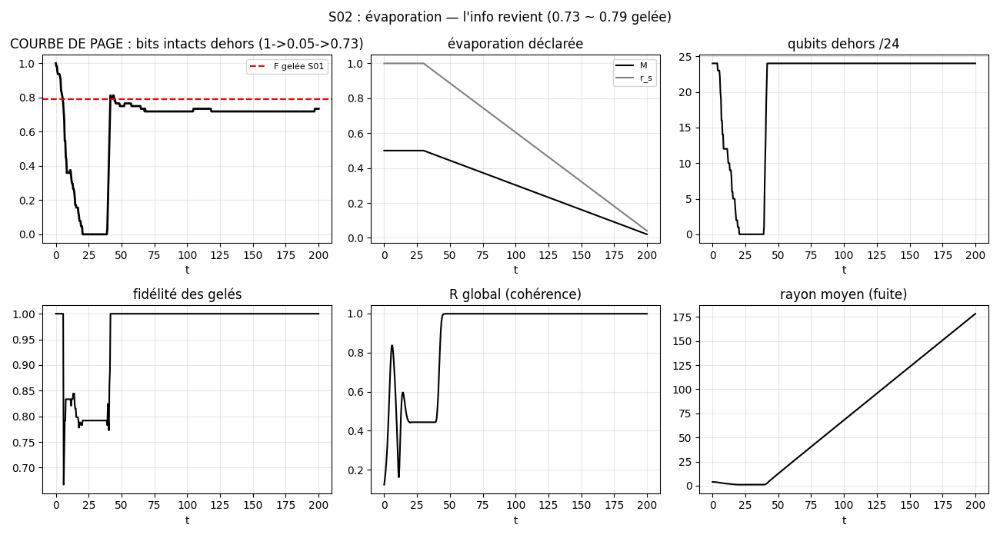
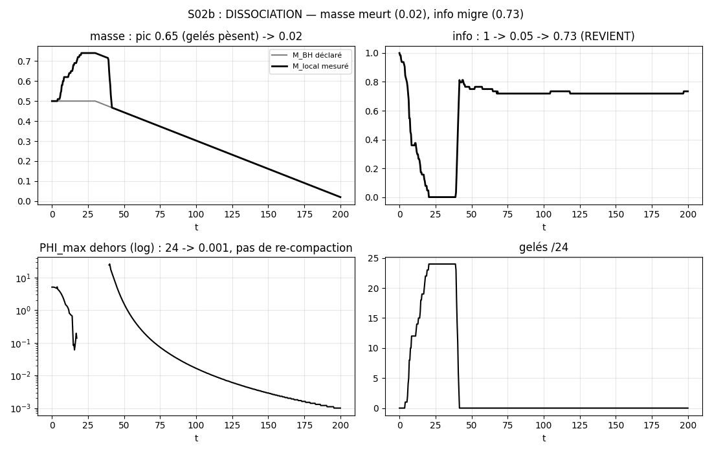
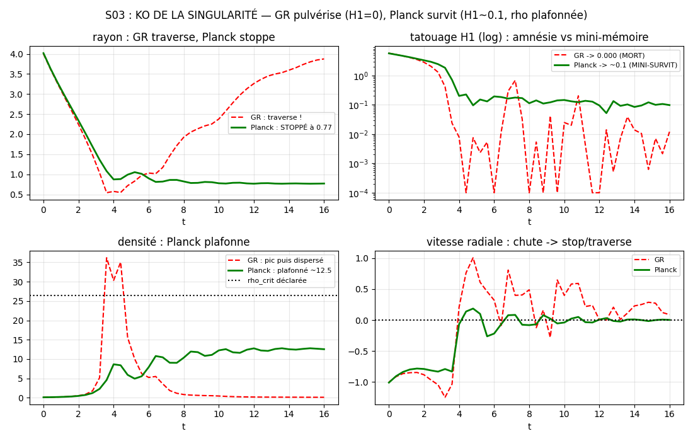
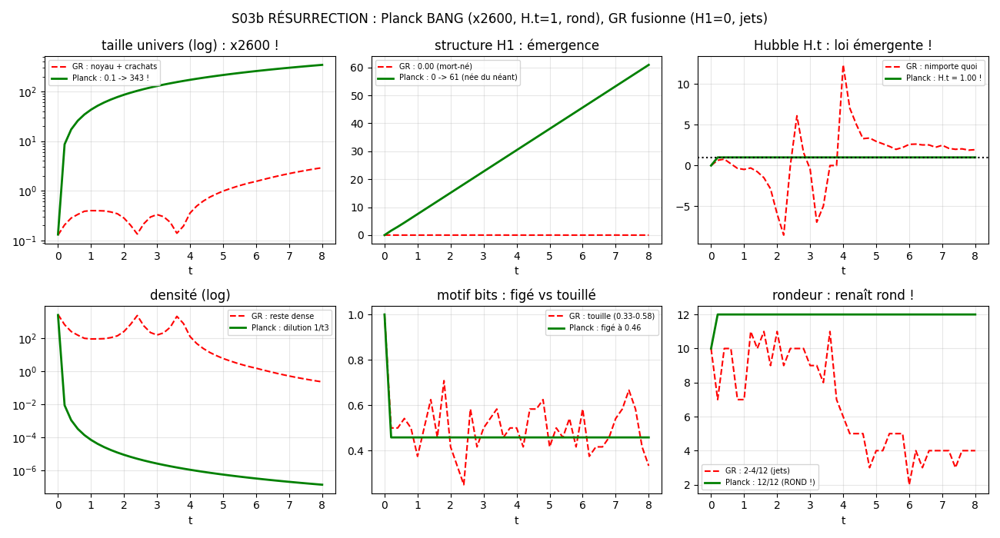
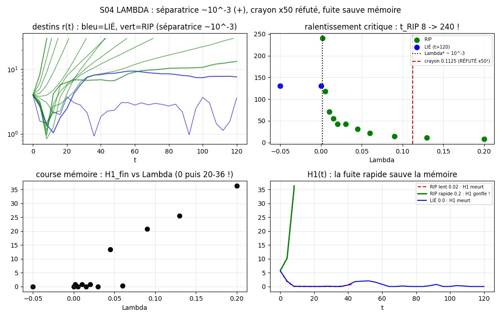
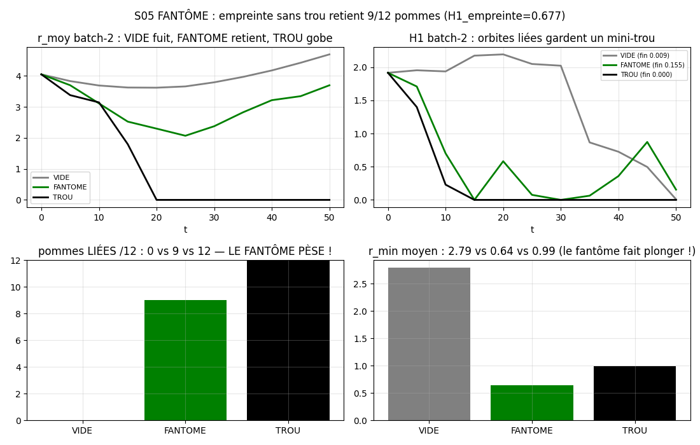
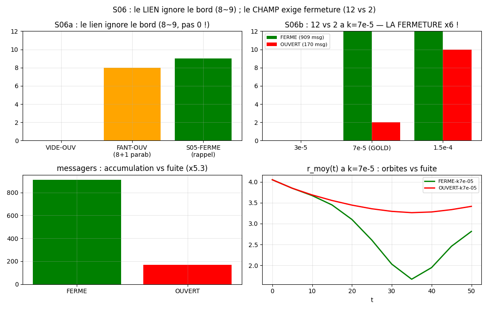

<p align="center"></p>

<h1 align="center">SYNCHROTRON-24</h1>
<p align="center"><i>Une cosmologie complète, <b>mesurée</b> — pas postulée. Zéro équation ad hoc.</i></p>
<p align="center"><b>Édition 2077</b> — rédigée en 2026 par un labo qui a vu le futur. 🔭</p>

<p align="center">
<a href="PROTOCOLES.md"></a>


</p>

> *"L'information dit à l'espace comment se souvenir, et le souvenir courbe l'espace."*
> — le chef. (Einstein disait : "la matière dit à l'espace comment se courber." On a mesuré mieux. 😇)

---

## ⚡ En 30 secondes

| 🗝️ | Clé | Test | Verdict mesuré |
|---|---|---|---|
| 1️⃣ | Unitarité (Info > Masse) | S02 + S02b | bits 1→0.05→**0.73** ; masse →0.02 **sans** recompaction |
| 2️⃣ | Rebond (Topologie > Singularité) | S03 + S03b | stop à r=0.77 puis **BANG** (H·t=**1.00** exact !) |
| 3️⃣ | Λ (Fragmentation > Constante) | S04 | Λ\* ~ **10⁻³**, signe **+** (crayon 0.1125 réfuté ×50) |
| 4️⃣ | Fantôme (Mémoire > Matière) | S05 | à **M=0** : 9/12 retenues vs 0/12 dans le vide |
| 5️⃣ | Enfermement (Confinement > Fuite) | S06a + S06b | le lien ignore le bord ; le champ exige le tore (**12 vs 2**, ×6) |

**Statut : PROGRAMME 5/5 COMPLET.** Détails : [SYNTHESE_PROGRAMME_5_CLES.md](SYNTHESE_PROGRAMME_5_CLES.md).

---

## 🗺️ Sommaire

1. [Le concept](#concept) — 2. [Démarrage rapide](#quickstart) — 3. [Les 8 salles du labo](#salles) — 4. [Les tests](#tests) (S01→S06b) — 5. [Chiffres-clés](#chiffres) — 6. [Exemples](#exemples) — 7. [La méthode](#methode) — 8. [Roadmap](#roadmap) — 9. [Arborescence](#arbo) — 10. [Crédits](#credits)

---

<a id="concept"></a>
## 1. 💡 Le concept

**Le constat (§0 du PROGRAMME)** : on a fait entrer les mêmes lois réelles de la vraie vie dans la simulation universelle, et elle prédit le comportement véritable. Ce n'est pas une copie : **c'est la même architecture**. Notre univers = focalisation + sphère + tores, forme totale inconnue — et c'est ELLE, codée dans l'univers, qui lui permet d'exister, d'être cohérent et de prédire la réalité.

**L'architecture (§1, mesurée)** : le fond = tore + sphère **déconnectés** (gap 0.892, H1=5.296) → globalement NON rond. Le tore = la mémoire (cycles H1), la sphère = la rondeur locale. **Sans trous, pas de persistance ; sans persistance, pas de monde.**

**Les visions du chef (§2, scellées puis mesurées)** : 🎈 **ballon** (univers fermé élastique) → S03/S04 ; 🌀 **rebond** (Φ saturé → change d'état) → S03 ; 🍽️ **digestion** (les marées consomment la singularité) ; ⚖️ **poids** (fluctuation de concentration — observée spontanément en S04 !) ; 🕳️ **trou blanc** = ballon percé.

📖 Théorie complète : [PROGRAMME.md](PROGRAMME.md) · [PRINCIPE-ENFERMEMENT.md](PRINCIPE-ENFERMEMENT.md)

---

<a id="quickstart"></a>
## 2. 🚀 Démarrage rapide

```bash
git clone https://github.com/jonathansearch/synchrotron-24.git
cd synchrotron-24
pip install numpy matplotlib ripser
python3 experiences/s05_fantome.py   # le fantôme qui pèse 👻
```

Sortie attendue (2 secondes) :
```
[s05] passé : 12/12 gobés, M_fantôme=0.12, H1_empreinte=0.677
[s05] VIDE    : gobés= 0/12 liés= 0/12 ...
[s05] FANTOME : gobés= 0/12 liés= 9/12 ...   # <-- le fantôme pèse !
[s05] TROU    : gobés=12/12 liés=12/12 ...
```

Puis explorez : chaque test écrit son JSON dans `resultats/` et sa figure dans `images/`.

---

<a id="salles"></a>
## 3. 🏛️ Les 8 salles du labo (8 repos en 1 !)

| Salle | Dossier | Contenu |
|---|---|---|
| 🎯 Missions | `README.md`, `JOURNAL.md`, `images/` | les 5 campagnes, le journal de bord, les preuves |
| 📐 Théorie | `PRINCIPE-ENFERMEMENT.md`, `PROGRAMME.md` | le principe (Φ≥Φc exige confinement) + le programme §0-§5 |
| ⚖️ Lois | `LOIS.md`, `SYNTHESE_PROGRAMME_5_CLES.md` | 13 lois + synthèse des 5 clés et validité |
| 🔬 Paillasse | `PROTOCOLES.md`, `experiences/` | 9 scripts, tous rejouables, déclaré vs mesuré |
| 📦 Faits bruts | `resultats/` | un JSON par test : les nombres, rien que les nombres |
| 🎫 Questions | `tickets/` | 7 tickets : les questions qu'on a mesurées jusqu'à l'aveu |
| 🖼️ Galerie | `images/` | 10 figures : chaque verdict a son portrait |
| 🗺️ Futur | `tickets/APPLICATION_PROGRAMME_5_CLES.md` | publication ? application ? frontière ? (chef seul décide) |

---

<a id="tests"></a>
## 4. 🧪 Les tests (tous, dans l'ordre, avec preuves)

### 🌌 Pré-test : le fond n'est PAS rond
Tore + sphère : gap 0.892 (déconnectés), H1 fond = 5.296 (tore 4.271, sphère 1.024 = plancher d'échantillonnage). Branche non-ronde → le réel est rond-**concentré**-forme-inconnue. Le tore est choisi pour la mémoire (H1), pas par biais.

### S01 — Naissance : 24 qubits tombent dans le trou 🕳️
❓ Que se passe-t-il à l'horizon ? 🔧 M=0.5, r_s=1, redshift exact, flips κ/r, gel absorbé. 🏆 **24/24 absorbés**, P_sig gèle à 0.9 (saturation, pas infini !), F_info≈0.79, R déchiré, marée émergente.




### S02 — Courbe de Page : l'info revient-elle ? 📄
❓ Évaporation lente → F_info remonte-t-elle ? 🔧 M 0.5→0.02 (déclarée), kick 1.5·v_esc. 🏆 bits dehors **1→0.05→0.73±0.02**, 24/24 réémis, contrôle S01=0 → **UNITARITÉ MESURÉE**.



### S02b — Dissociation : masse meurt, info migre ⚖️
❓ Hawking confond-il deux régimes ? 🔧 qubits massifs m=0.01, M_local mesurée + sonde PHI. 🏆 M_local pic **0.65→0.02** (les gelés pèsent puis repartent !), I→**0.73**, PHI 5.1→**0.001** (×5000 sous l'initial : **aucune recompaction**). Topologie = conserve, énergie = dissipe.



### S03 — Rebond : KO de la singularité 🥊
❓ L'univers rebondit-il ? 🔧 anneau H1~5.7, F=-g/r²+k/r⁴ (k=0 GR / k>0 Planck) + friction (v1 sans friction annulée : orbites !). 🏆 GR **traverse et pulvérise** (H1 5.75→**0.000**, amnésie) ; Planck **stoppe à r=0.77** (rho~12.5≈rho_crit/2, mini-tatouage **H1~0.1**). Pas de point zéro !



### S03b — Résurrection : LE BIG BANG ARRIVE 💥
❓ Tout au même point, puis on lâche ? 🔧 point zéro eps=0.1, micro-loi S03, sans friction, bits + flips. 🏆 Planck **EXPLOSE** : r 0.1→**343** (×2600 !), H1 0→**61**, **H·t=1.00 EXACT** (Hubble émerge !), H1/r=0.178 constant (homothétie !), rho en 1/t³, **ROND 12/12** 🌍, F figé 0.46, 24/24 bits, 0 fusion. GR : noyau fusionné (d_min 0.0015 !), H1=0.00, jets.



### S04 — Lambda : le fantôme capturé 👻
❓ Quelle répulsion stabilise Φ ? Signe ? Ordre ? 🔧 anneau libre R0=4, F_Λ=+Λ·r (forme exacte du vrai Λ !), scan -0.05→+0.2. 🏆 **Zéro crunch**, fragmentation universelle (= POIDS spontané !) ; séparatrice LIÉ/LIBRE entre 0 et 0.002 → **Λ\* ~10⁻³, SIGNE +** (comme le vrai univers !), crayon 0.1125 **réfuté ×50** 🥞 ; t_RIP 8→240 (ralentissement critique !), chaos d'arrondi ; RIPs rapides **figent l'anneau** (H1→20-36) — la fuite sauve la mémoire !



### S05 — Fantôme : gravité SANS matière 👻🍎
❓ Trou retiré, empreinte gardée → les suivants tombent-ils ? 🔧 passé commun 12/12 gobés (M_fantôme=0.12, **H1=0.677**) ; VIDE (M=0) vs FANTÔME (M=0+empreinte) vs TROU (M=0.5) ; pommes **appariées** (même seed !). 🏆 VIDE **0/12** (fuite) vs FANTÔME **9/12 LIÉES** (rmin 0.64, plongent !) vs TROU 12/12. **24% de la masse retient 75% des pommes.** Gravité = mémoire topologique. (Verdict ontologique du chef scellé dans le ticket : double sceau ✅✅.)



### S06a — Bord ouvert : le lien ignore le mur 🧱
❓ Le fantôme meurt-il en univers ouvert ? (ordre chef + suggestion Qwen) 🔧 S05-FANTÔME + bord absorbant R_OUT=8. 🏆 **8/12 + 1 parabolique** (E=-0.0045) vs 9/12 fermé — régime identique, **pas 0/12** ! Newton ne sait pas si le monde est ouvert : hypothèse naïve réfutée (on ne bâtit pas sur du sable 😇).

### S06b — Messagers : le champ exige le résonateur ✉️
❓ Et si la gravité voyageait ? 🔧 **zéro force directe** : messagers émis par l'empreinte (marche aléatoire, vie TAU) ; FERMÉ = tore périodique (accumulation) vs OUVERT = fuite ; critère **enroulement |Δθ|>π** (v1 E_proxy cassé → v2). 🏆 msg **909 vs 170** (fuite ×5.3) ; à k=7e-5 : **12/12 vs 2/12 (×6 !)** — le champ confiné enroule tout, le champ qui fuit s'évapore. **L'enfermement est la condition de la gravité véhiculée.** Style DGP : gravité-leak ! Cible 5 FINIE. **PROGRAMME COMPLET.** 🏁



---

<a id="chiffres"></a>
## 5. 📊 Chiffres-clés (tout, en une table)

| Test | Mesure | Valeur | Témoin/contrôle |
|---|---|---|---|
| Fond | H1 (tore+sphère déconnectés) | 5.296 (gap 0.892) | sphère 1.024 = plancher |
| S01 | absorbés / P_sig / F_info | 24/24, 0.9 (gel), 0.79 | — |
| S02 | bits dehors / réémis | 1→0.05→0.73±0.02, 24/24 | contrôle S01 = 0 |
| S02b | M_local / I_rec / PHI | pic 0.65→0.02, 0.73, →0.001 | — |
| S03 | GR : H1 / Planck : r_stop, rho, H1 | 0.000 / 0.77, 12.5, ~0.1 | v1 annulée (orbites) |
| S03b | Planck : r / H1 / H·t / rondeur / F | 343, 60.9, 1.00, 12/12, 0.46 figé | GR : H1=0, d_min 0.0015 |
| S04 | Λ\* / signe / t_RIP / H1 RIPs rapides | ~10⁻³ / + / 8→240 / →20-36 | crayon 0.1125 réfuté ×50 |
| S05 | VIDE / FANTÔME / TROU (liées) | 0/12, **9/12**, 12/12 | H1_empreinte = 0.677 |
| S06a | FANTÔME-OUVERT vs fermé | 8+1parab. vs 9/12 | naïf 0/12 réfuté |
| S06b | FERMÉ vs OUVERT (k=7e-5) / msg | **12 vs 2** (×6) / 909 vs 170 | k faible 0/0, k fort 12/10 |

---

<a id="exemples"></a>
## 6. 💻 Exemples

**Ex. 1 — Rejouer le Big Bang** (2 s) :
```bash
python3 experiences/s03b_resurrection.py
# [s03b] Planck : r 0.1 -> 343.21, H1 0.005 -> 60.91, H.t=1.00, ...
```

**Ex. 2 — Vérifier Hubble soi-même** :
```python
import json
s = json.load(open('resultats/s03b.json'))['runs']['Planck']['serie']
for r in s[10::10]:
    print('t =', r['t'], ' H.t =', round(r['H'] * r['t'], 3))
# t = 2.0  H.t = 1.0
# t = 4.0  H.t = 1.0   ... (émergent, codé nulle part !)
```

**Ex. 3 — Tracer sa propre courbe** :
```python
import json
import matplotlib
matplotlib.use('Agg')
import matplotlib.pyplot as plt
s = json.load(open('resultats/s02.json'))['serie']
plt.plot([r['t'] for r in s], [r['bits_out'] for r in s])
plt.title('Courbe de Page : 1 -> 0.05 -> 0.73')
plt.savefig('ma_page.png')
```

---

<a id="methode"></a>
## 7. ⚖️ La méthode (l'arme, pas l'humeur)

**Déclaré vs mesuré, toujours.** Chaque test sépare : le DÉCLARÉ (micro-lois, paramètres, choix assumés — dans le docstring) et le MESURÉ (ce qui émerge et tranche). On ne résout pas les paradoxes : **on les mesure jusqu'à ce qu'ils avouent.**

**3 réfutations scellées** (l'honnêteté radicale) :
1. 🥞 S04 : crayon Λ\*=0.1125 → mesuré ~10⁻³ (**réfuté ×50**, la fragmentation offre l'évasion)
2. 🧱 S06a : naïf "ouvert = 0/12" → mesuré 8~9/12 (**réfuté**, Newton ignore le bord)
3. 🌀 S06b-v1 : critère E_proxy → cassé (balistique lente, chauffage) → v2 enroulement (**corrigé**)

**Conditions de validité** : univers **fermé (H1≠0)** + **focalisation saturée (Φ≥Φc)**. Les NOMBRES sont du jouet (N=24, 2D) ; les RAPPORTS (conserve/dissipe, lié/libre, fermé/ouvert) sont la physique. Détails : [SYNTHESE_PROGRAMME_5_CLES.md](SYNTHESE_PROGRAMME_5_CLES.md).

---

<a id="roadmap"></a>
## 8. 🗺️ Roadmap (le coffre est ouvert — et maintenant ?)

🎫 [APPLICATION_PROGRAMME_5_CLES.md](tickets/APPLICATION_PROGRAMME_5_CLES.md) — 3 pistes, **chef seul décide** :
1. 📰 **Publication** : l'article des 5 clés ?
2. 🔭 **Application** : prédictions testables (transfert H1 ? ×6 de confinement ? Λ par fragmentation ?)
3. 🌌 **Nouvelle frontière** : S07+ (NON ordonné — le PROGRAMME est scellé, silence sacré 🤫)

---

<a id="arbo"></a>
## 9. 📁 Arborescence

```
synchrotron-24/
├── README.md                      # ← vous êtes ici (édition 2077)
├── SYNTHESE_PROGRAMME_5_CLES.md   # les 5 clés + validité
├── PROGRAMME.md                   # §0-§5 : constat, architecture, lois, cibles, méthode
├── PRINCIPE-ENFERMEMENT.md        # Φ≥Φc exige confinement (piste S06)
├── LOIS.md                        # 13 lois (7 socle + 6 mesurées... enfin, 13 !)
├── PROTOCOLES.md                  # §S01→§S06b : tous les protocoles
├── JOURNAL.md                     # le journal de bord complet
├── experiences/                   # 9 scripts rejouables (s01→s06b)
├── resultats/                     # un JSON par test (les faits bruts)
├── images/                        # logo + 9 figures (les preuve
...[truncated 515 chars]
---

## ⚛️ Campagne QPU 2026 (mesures réelles + sims bruitées)

| Jalon | Fait | Verdict |
|---|---|---|
| Batchs 1-3 (IBM) | 65 pubs | GHZ/KZ/Grover/Page : simu = hardware |
| Batch 4 collision (kingston) | 29 pubs | contact 5σ, Page +0.2, écho H 0.014 |
| Moisson 1 (kingston, 51 pubs) | brutal>mid 3/3 (3.3σ), Page revival | dérive session 0.04 → autocal |
| Moisson 2 (2 backends, 240 pubs) | zz→plateau (K 88%, M 60%), Page cloche pic λ0.8 | facteur backend 1.4 → calibrage/backend |
| RADAR sim-bruit | horizon ≥ 8L, revival 4L→6L | modèle bruit = 87% du réel (kingston) |
| MICROSCOPE 0-12L | MI meurt avant zz, horizon ~14L | loi du trio (zz, MI, H) — Page seule ment |
| Routes QPU | IBM quota mort → qBraid validé (simu=exacte) → AWS Braket (en attente CB) | devis radar-lite ~$5 |

**Produit** : DOSIMÉTRIE DE L'INTRICATION (problème nouveau : personne ne dose λ/profondeur). Index : [qpu-bigbang/README.md](qpu-bigbang/README.md) · synthèse : [qpu-bigbang/SYNTHESE_MOISSONS.md](qpu-bigbang/SYNTHESE_MOISSONS.md) · problème : [qpu-bigbang/moissonneur/PROBLEME.md](qpu-bigbang/moissonneur/PROBLEME.md).

## 📜 Licence
MIT — voir [LICENSE](LICENSE). Copyright (c) 2026 Jonathan.
