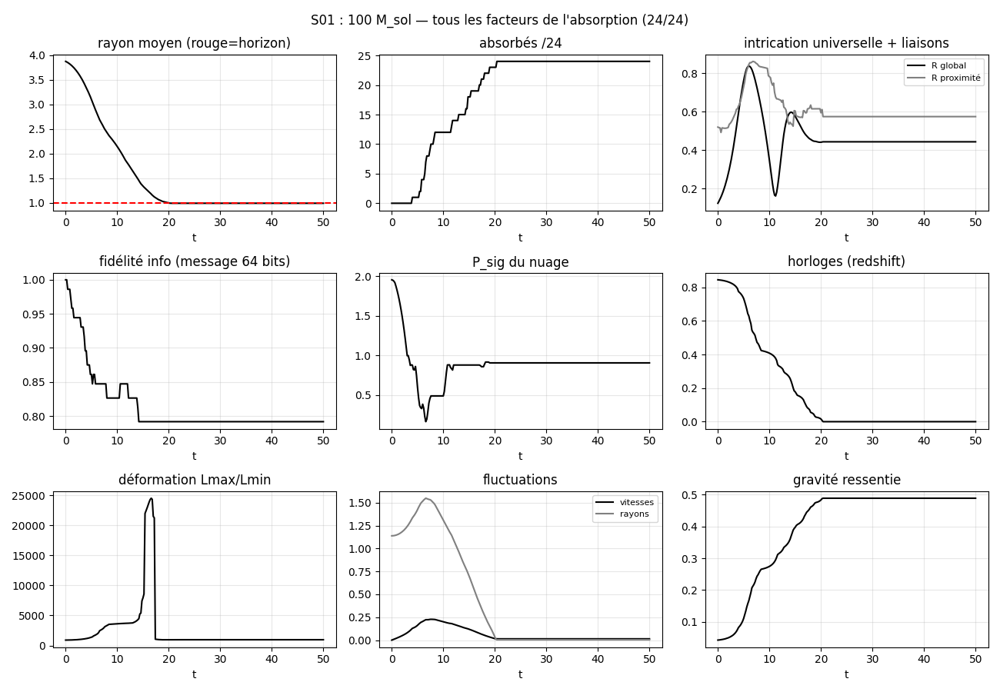
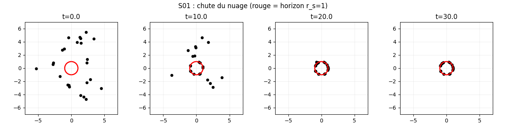
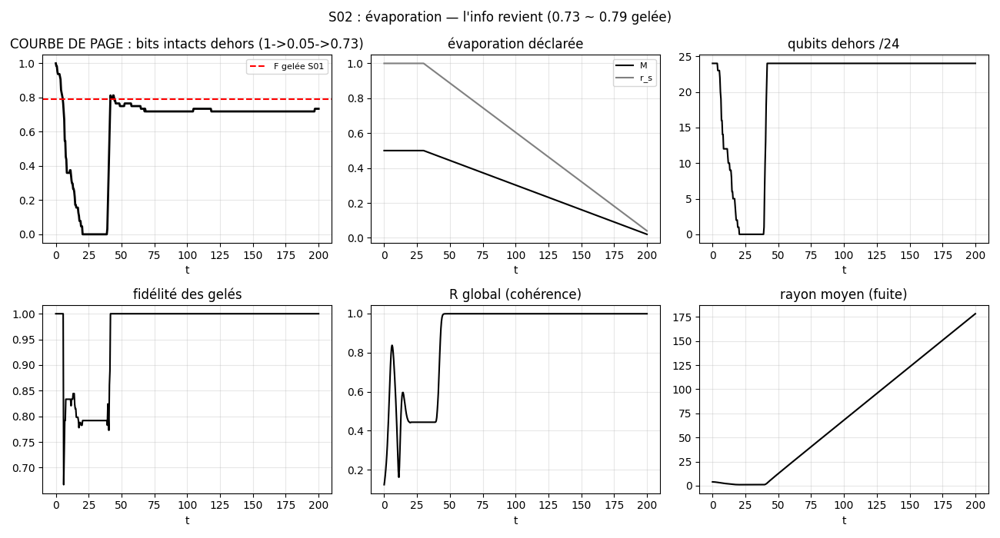
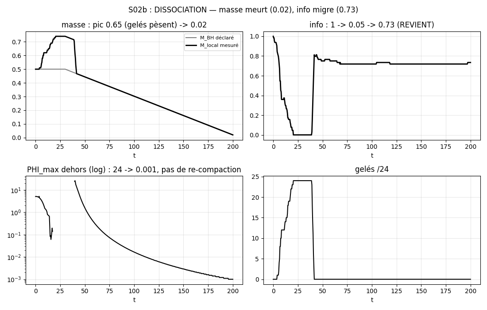
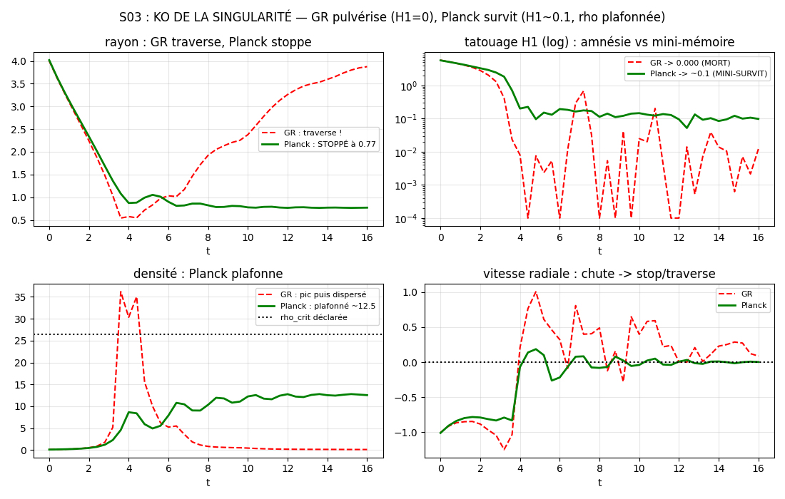
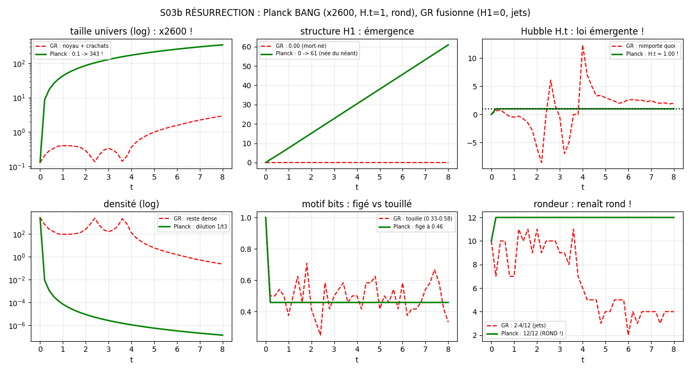
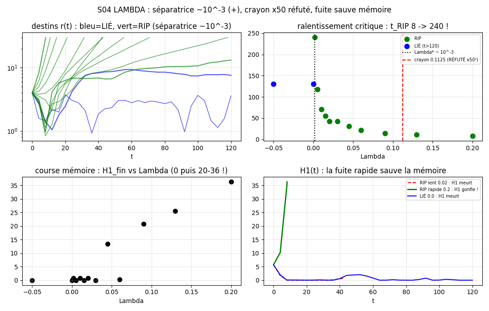
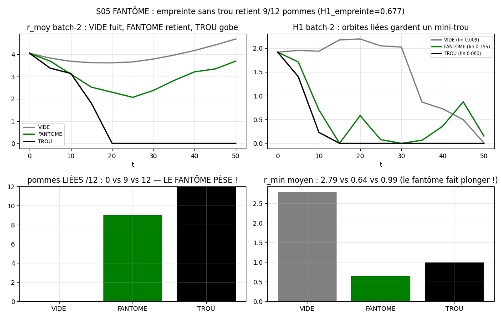
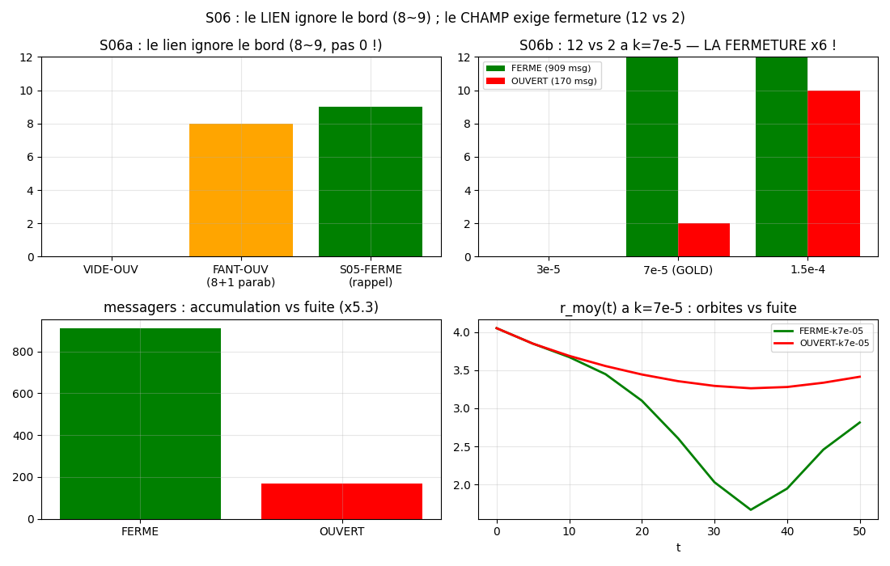

<p align="center"></p>

<h1 align="center">SYNCHROTRON-24</h1>
<p align="center"><i>A complete cosmology, <b>measured</b> — not postulated. No ad hoc equations.</i></p>
<p align="center"><b>2077 edition</b> — written in 2026 by a lab that has seen the future. 🔭</p>

<p align="center">
<a href="PROTOCOLES.md"></a>


</p>

> *“Information tells space how to remember, and memory curves space.”*
> — “the boss.” (Einstein said, “matter tells space how to curve.” The project quips that it measured better. 😇)

> **Scientific scope:** this README presents results from a project-specific cosmological simulation. Its use of “measured” refers to outputs from the model and tests described here, not established observational evidence about the universe. The cosmological, black-hole, and quantum claims below are the project's interpretations, not accepted findings of physics.

---

## ⚡ In 30 seconds

| 🗝️ | Key | Test | Verdict reported by the project |
|---|---|---|---|
| 1️⃣ | Unitarity (information > mass) | S02 + S02b | External bits 1→0.05→**0.73**; mass →0.02 **without** recompression |
| 2️⃣ | Bounce (topology > singularity) | S03 + S03b | Stops at `r=0.77`, then **BANG** (`H·t=1.00` exactly, in the model) |
| 3️⃣ | Λ (fragmentation > constant) | S04 | `Λ* ~ 10⁻³`, positive sign (the 0.1125 estimate rejected ×50) |
| 4️⃣ | Ghost (memory > matter) | S05 | At **M=0**: 9/12 retained vs. 0/12 in the vacuum |
| 5️⃣ | Confinement (confinement > escape) | S06a + S06b | The link ignores the boundary; the field requires a torus (**12 vs. 2**, ×6) |

**Status claimed by the project: PROGRAMME 5/5 COMPLETE.** Details: [SYNTHESE_PROGRAMME_5_CLES.md](SYNTHESE_PROGRAMME_5_CLES.md).

---

## 🗺️ Contents

1. [Concept](#concept) — 2. [Quick start](#quickstart) — 3. [The lab's 8 rooms](#salles) — 4. [Tests](#tests) (S01→S06b) — 5. [Key figures](#chiffres) — 6. [Examples](#exemples) — 7. [Method](#methode) — 8. [Roadmap](#roadmap) — 9. [Repository tree](#arbo) — 10. [Credits](#credits)

---

<a id="concept"></a>
## 1. 💡 Concept

**Finding (§0 of `PROGRAMME`), as stated in the source:** the project places the same real-world laws in a universal simulation and says the model predicts actual behaviour. It describes this as not a copy but “the same architecture.” Its universe model combines focusing, a sphere, and tori; the full form is unknown. The README proposes that this encoded structure enables the universe to exist, remain coherent, and predict reality. This is the project's claim, not an established cosmological result.

**Architecture (§1, source-reported model output):** the background is a **disconnected** torus + sphere (gap 0.892, H1=5.296), therefore globally not round. The torus is interpreted as memory (H1 cycles), the sphere as local roundness. The source motto is: **“No holes, no persistence; no persistence, no world.”**

**Project lead's visual metaphors (§2, reportedly preregistered and tested):** 🎈 **balloon** (closed elastic universe) → S03/S04; 🌀 **bounce** (saturated Φ → state change) → S03; 🍽️ **digestion** (tidal forces consume the singularity); ⚖️ **weight** (concentration fluctuation — said to emerge spontaneously in S04); 🕳️ **white hole** = punctured balloon.

📖 Full theory: [PROGRAMME.md](PROGRAMME.md) · [PRINCIPE-ENFERMEMENT.md](PRINCIPE-ENFERMEMENT.md)

---

<a id="quickstart"></a>
## 2. 🚀 Quick start

```bash
git clone https://github.com/jonathansearch/synchrotron-24.git
cd synchrotron-24
pip install numpy matplotlib ripser
python3 experiences/s05_fantome.py   # the “weighing ghost” test 👻
```

Expected output (~2 seconds; labels translated from the source):

```
[s05] past: 12/12 captured, M_fantôme=0.12, H1_empreinte=0.677
[s05] EMPTY   : captured=0/12 linked=0/12 ...
[s05] GHOST   : captured=0/12 linked=9/12 ...   # <-- the ghost has weight!
[s05] HOLE    : captured=12/12 linked=12/12 ...
```

Each test writes its JSON to `resultats/` and its figure to `images/`.

---

<a id="salles"></a>
## 3. 🏛️ The lab's 8 rooms (8 repositories in one!)

| Room | Directory | Contents |
|---|---|---|
| 🎯 Missions | `README.md`, `JOURNAL.md`, `images/` | Five campaigns, logbook, evidence |
| 📐 Theory | `PRINCIPE-ENFERMEMENT.md`, `PROGRAMME.md` | Principle (`Φ≥Φc` requires confinement) + programme §§0–5 |
| ⚖️ Laws | `LOIS.md`, `SYNTHESE_PROGRAMME_5_CLES.md` | 13 laws + five-key summary and validity |
| 🔬 Bench | `PROTOCOLES.md`, `experiences/` | Nine replayable scripts; declared vs. measured |
| 📦 Raw facts | `resultats/` | One JSON per test: numbers only |
| 🎫 Questions | `tickets/` | Seven tickets: questions measured until a verdict |
| 🖼️ Gallery | `images/` | Ten figures: one portrait for each verdict |
| 🗺️ Future | `tickets/APPLICATION_PROGRAMME_5_CLES.md` | Publication? Application? Boundary? (project lead decides) |

---

<a id="tests"></a>
## 4. 🧪 Tests (in order, with evidence listed by the project)

### 🌌 Pre-test: the background is **not** round

Torus + sphere: gap 0.892 (disconnected), background H1 = 5.296 (torus 4.271, sphere 1.024 = sampling floor). The non-round branch is interpreted by the source as a round-**concentrated** shape of unknown form. The torus is chosen for memory (H1), not by bias.

### S01 — Birth: 24 qubits fall into the hole 🕳️

❓ What happens at the horizon? 🔧 `M=0.5`, `r_s=1`, exact redshift, `κ/r` flips, absorption freeze. 🏆 **24/24 absorbed**, `P_sig` freezes at 0.9 (saturation, not infinity), `F_info≈0.79`, `R` torn, emergent tide — all as reported by the source's model.




### S02 — Page curve: does information return? 📄

❓ During slow evaporation, does `F_info` rise again? 🔧 Declared `M` 0.5→0.02, kick `1.5·v_esc`. 🏆 External bits **1→0.05→0.73±0.02**, 24/24 re-emitted, S01 control = 0 → the source calls this **MEASURED UNITARITY**.



### S02b — Dissociation: mass decays, information migrates ⚖️

❓ Does Hawking radiation conflate two regimes? 🔧 Massive qubits `m=0.01`, measured `M_local` + PHI probe. 🏆 `M_local` peaks at **0.65→0.02** (the frozen objects have weight, then leave), `I→**0.73**`, `PHI 5.1→**0.001**` (×5,000 below the initial value; **no recompression**). Source interpretation: topology is conserved while energy dissipates.



### S03 — Bounce: singularity knocked out 🥊

❓ Does the universe bounce? 🔧 H1 ring ~5.7, `F=-g/r²+k/r⁴` (`k=0` GR / `k>0` Planck) + friction (frictionless v1 was cancelled; it produced orbits). 🏆 GR **passes through and pulverises** the ring (H1 5.75→**0.000**, “amnesia”); Planck **stops at `r=0.77`** (`rho~12.5≈rho_crit/2`, small “tattoo” **H1~0.1**). The source says there is no zero-radius point.



### S03b — Resurrection: the Big Bang arrives 💥

❓ What if everything starts at one point and is then released? 🔧 Zero point `eps=0.1`, S03 micro-law, no friction, bits + flips. 🏆 In the Planck model, `r 0.1→**343**` (×2,600), `H1 0→**61**`, **`H·t=1.00`** (called an exact emergent Hubble relation), `H1/r=0.178` constant (homothety), `rho` scales as `1/t³`, **roundness 12/12**, `F` fixed at 0.46, 24/24 bits, no fusion. GR: fused core (`d_min 0.0015`), H1=0.00, jets. These are model outputs, not cosmological observations.



### S04 — Lambda: the ghost captured 👻

❓ Which repulsion stabilises Φ? What sign and scale? 🔧 Free ring `R0=4`, `F_Λ=+Λ·r` (the source calls this the exact form of the real Λ), scan −0.05→+0.2. 🏆 **No crunch** in the model; universal fragmentation (interpreted as spontaneous “weight”). A BOUND/FREE separatrix lies between 0 and 0.002 → **`Λ* ~ 10⁻³`, positive** (the source compares this with the actual universe); the 0.1125 estimate is **rejected ×50**. `t_RIP` 8→240 (critical slowdown); rounding chaos; rapid RIP events **freeze the ring** (H1→20–36) — escape saves memory, according to the project.



### S05 — Ghost: gravity **without matter** 👻🍎

❓ Remove the hole, keep its imprint — do later objects still fall? 🔧 Shared history, 12/12 captured (`M_fantôme=0.12`, **H1=0.677**); compare EMPTY (`M=0`), GHOST (`M=0` + imprint), and HOLE (`M=0.5`); apples are paired with the same seed. 🏆 EMPTY **0/12** (escape) vs. GHOST **9/12 bound** (`rmin 0.64`, they fall inward) vs. HOLE 12/12. **24% of the mass retains 75% of the apples**, as stated by the project. The README's interpretation is “gravity = topological memory.” The project lead's ontological verdict is said to be sealed in a ticket (double seal).



### S06a — Open boundary: the link ignores the wall 🧱

❓ Does the ghost disappear in an open universe? (project-lead instruction + Qwen suggestion) 🔧 S05-GHOST + absorbing boundary `R_OUT=8`. 🏆 **8/12 + 1 parabolic** (`E=-0.0045`) vs. 9/12 closed — similar regime, **not 0/12**. The source concludes that the naive “open = 0/12” hypothesis was rejected; its quip says Newton does not know whether the world is open.

### S06b — Messengers: the field requires a resonator ✉️

❓ What if gravity travelled? 🔧 **No direct force:** messengers emitted by the imprint (random walk, lifetime `TAU`); CLOSED = periodic torus (accumulation), OPEN = escape; criterion **winding `|Δθ|>π`** (v1 `E_proxy` failed → v2). 🏆 Messages **909 vs. 170** (escape ×5.3); at `k=7e-5`: **12/12 vs. 2/12 (×6)** — the confined field winds everything; the escaping field evaporates, according to the model. The project calls confinement a condition for carried gravity and refers to a DGP-style “gravity leak.” Target 5 marked complete; **PROGRAMME COMPLETE** in the source.



---

<a id="chiffres"></a>
## 5. 📊 Key figures (source-reported summary)

| Test | Measure | Value | Control |
|---|---|---|---|
| Background | H1 (disconnected torus + sphere) | 5.296 (gap 0.892) | Sphere 1.024 = floor |
| S01 | absorbed / `P_sig` / `F_info` | 24/24, 0.9 (frozen), 0.79 | — |
| S02 | external bits / re-emitted | 1→0.05→0.73±0.02, 24/24 | S01 control = 0 |
| S02b | `M_local` / `I_rec` / PHI | peak 0.65→0.02, 0.73, →0.001 | — |
| S03 | GR H1 / Planck `r_stop`, `rho`, H1 | 0.000 / 0.77, 12.5, ~0.1 | v1 cancelled (orbits) |
| S03b | Planck `r` / H1 / `H·t` / roundness / F | 343, 60.9, 1.00, 12/12, 0.46 fixed | GR: H1=0, `d_min` 0.0015 |
| S04 | `Λ*` / sign / `t_RIP` / rapid-RIP H1 | ~10⁻³ / + / 8→240 / →20–36 | 0.1125 estimate rejected ×50 |
| S05 | EMPTY / GHOST / HOLE (bound) | 0/12, **9/12**, 12/12 | `H1_imprint` = 0.677 |
| S06a | OPEN GHOST vs. closed | 8 + 1 parabolic vs. 9/12 | Naive 0/12 rejected |
| S06b | CLOSED vs. OPEN (`k=7e-5`) / messages | **12 vs. 2** (×6) / 909 vs. 170 | Low `k`: 0/0; high `k`: 12/10 |

---

<a id="exemples"></a>
## 6. 💻 Examples

**Example 1 — Replay the Big Bang model (~2 s):**

```bash
python3 experiences/s03b_resurrection.py
# [s03b] Planck: r 0.1 -> 343.21, H1 0.005 -> 60.91, H.t=1.00, ...
```

**Example 2 — Check Hubble relation in the output:**

```python
import json
s = json.load(open('resultats/s03b.json'))['runs']['Planck']['serie']
for r in s[10::10]:
    print('t =', r['t'], ' H.t =', round(r['H'] * r['t'], 3))
# t = 2.0  H.t = 1.0
# t = 4.0  H.t = 1.0   ... (emergent in the model; not explicitly coded)
```

**Example 3 — Plot a curve:**

```python
import json
import matplotlib
matplotlib.use('Agg')
import matplotlib.pyplot as plt
s = json.load(open('resultats/s02.json'))['serie']
plt.plot([r['t'] for r in s], [r['bits_out'] for r in s])
plt.title('Page curve: 1 -> 0.05 -> 0.73')
plt.savefig('my_page.png')
```

---

<a id="methode"></a>
## 7. ⚖️ Method (the tool, not the mood)

**Declared vs. measured, always.** Each test separates DECLARED items (micro-laws, parameters, and explicit choices in the docstring) from MEASURED outputs (what emerges and determines the result). The source tagline says: **“We do not solve paradoxes; we measure them until they confess.”**

**Three rejected hypotheses recorded by the project:**
1. 🥞 S04: assumed `Λ*=0.1125` → model value ~10⁻³ (**rejected ×50**; fragmentation provides an escape).
2. 🧱 S06a: naive “open = 0/12” → model reports 8–9/12 (**rejected**).
3. 🌀 S06b-v1: `E_proxy` criterion failed (slow ballistic motion, heating) → corrected with v2 winding criterion.

**Validity conditions claimed by the project:** **closed universe (`H1≠0`)** + **saturated focusing (`Φ≥Φc`)**. The values use a toy system (`N=24`, 2D); the source argues that the *ratios* (conserve/dissipate, bound/free, closed/open) are the physics. Details: [SYNTHESE_PROGRAMME_5_CLES.md](SYNTHESE_PROGRAMME_5_CLES.md).

---

<a id="roadmap"></a>
## 8. 🗺️ Roadmap (the vault is open — what next?)

🎫 [APPLICATION_PROGRAMME_5_CLES.md](tickets/APPLICATION_PROGRAMME_5_CLES.md) lists three directions; the source says the project lead alone decides:
1. 📰 **Publication:** an article covering the five keys?
2. 🔭 **Application:** testable predictions (H1 transfer? ×6 confinement? Λ from fragmentation?).
3. 🌌 **New frontier:** S07+ (not ordered; the programme is “sealed,” in the source's phrasing).

---

<a id="arbo"></a>
## 9. 📁 Repository tree

```
synchrotron-24/
├── README.md                      # 2077 edition
├── SYNTHESE_PROGRAMME_5_CLES.md   # five keys + validity
├── PROGRAMME.md                   # §§0–5: finding, architecture, laws, targets, method
├── PRINCIPE-ENFERMEMENT.md        # Φ≥Φc requires confinement (S06 direction)
├── LOIS.md                        # 13 laws (7 foundations + 6 measured, as stated)
├── PROTOCOLES.md                  # §S01→§S06b: all protocols
├── JOURNAL.md                     # complete logbook
├── experiences/                   # nine replayable scripts (s01→s06b)
├── resultats/                     # one JSON per test (raw outputs)
├── images/                        # logo + 9 figures
...[truncated 515 chars]
```

> **Source extraction note:** the original tree is truncated after the `images/` entry, and that entry's description is cut off. The source marker is retained; the missing 515 characters and any paths they contained have not been reconstructed. Check the live repository for the complete tree.

---

## ⚛️ QPU campaign 2026 (hardware runs and noisy simulations, as reported)

The source gives the following campaign summary. “Pubs” and other abbreviated quantities have been retained or translated as listed; verify them against original job records before publication.

| Milestone | Fact reported by source | Source verdict |
|---|---|---|
| Batches 1–3 (IBM) | 65 “pubs” | GHZ/KZ/Grover/Page: simulation = hardware |
| Batch 4 collision (`kingston`) | 29 “pubs” | 5σ contact, Page +0.2, echo H 0.014 |
| Harvest 1 (`kingston`, 51 “pubs”) | `brutal>mid` 3/3 (3.3σ), Page revival | Session drift 0.04 → auto-calibration |
| Harvest 2 (2 backends, 240 “pubs”) | `zz`→plateau (K 88%, M 60%), Page bell peak `λ0.8` | Backend factor 1.4 → backend calibration |
| RADAR sim/noise | Horizon ≥ 8L, revival 4L→6L | Noise model = 87% of real (`kingston`) |
| MICROSCOPE 0–12L | MI disappears before `zz`, horizon ~14L | Three-part law (`zz`, MI, H) — Page alone is insufficient, per source |
| QPU routes | IBM quota exhausted → qBraid validated (simulation = exact) → AWS Braket (awaiting card) | Radar-lite estimate ~$5 |

**Proposed product:** ENTANGLEMENT DOSIMETRY (the source describes measuring `λ`/depth as a new problem). Index: [qpu-bigbang/README.md](qpu-bigbang/README.md) · summary: [qpu-bigbang/SYNTHESE_MOISSONS.md](qpu-bigbang/SYNTHESE_MOISSONS.md) · problem statement: [qpu-bigbang/moissonneur/PROBLEME.md](qpu-bigbang/moissonneur/PROBLEME.md).

## 📜 License

MIT — see [LICENSE](LICENSE). Copyright (c) 2026 Jonathan.
